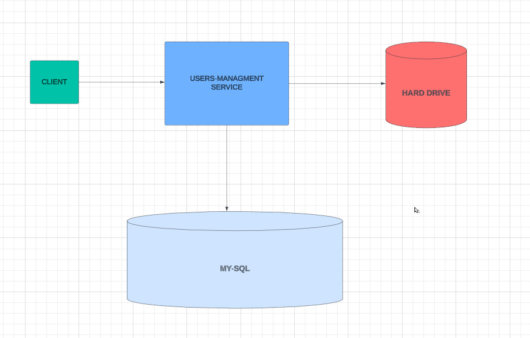
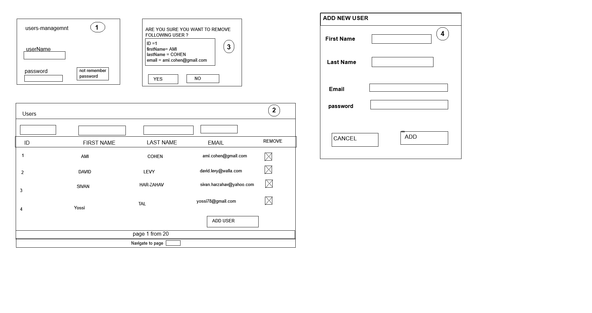

# Project Information and Limitations

---

## Retry Mechanism for Database Failures

There are multiple strategies to implement a retry mechanism that supports database failures:

1. **Eventual Consistency**  
   In case the database becomes unavailable, CRUD operations will be temporarily saved as JSON files. Once the database is restored, all changes will be synchronized. However, during the synchronization process, there may be some inconsistencies.

2. **High Availability**  
   This approach involves using an additional database like SQLite. All changes are synchronized with both databases in real-time. If the main database (MySQL) fails, SQLite will serve as a backup. When MySQL is restored, the two databases will be synchronized. This ensures high availability, but at the cost of data duplication.

In this solution, I have chosen the **Eventual Consistency** approach. Generally, I recommend using **AWS Aurora (MySQL)** as the main database, as it is a managed service that provides several high-availability features.

For more information on AWS Aurora and its high-availability features, visit the [official documentation](https://docs.aws.amazon.com/AmazonRDS/latest/AuroraUserGuide/Concepts.AuroraHighAvailability.html).

---

## Architecture Diagrams

### Backend Diagram:


### Frontend Diagram:


---

## Instructions

1. Download the Postman collection from the "resources" package.
2. Create new folder in the hard drive which appear in class of "WatchdogFileService"
    c:\temp\watchdog\

---

## Running the MySQL Database Container

1. Open a terminal in the root directory of the project.
2. Run the following command to start the MySQL container:
   ```bash
   docker-compose up -d
